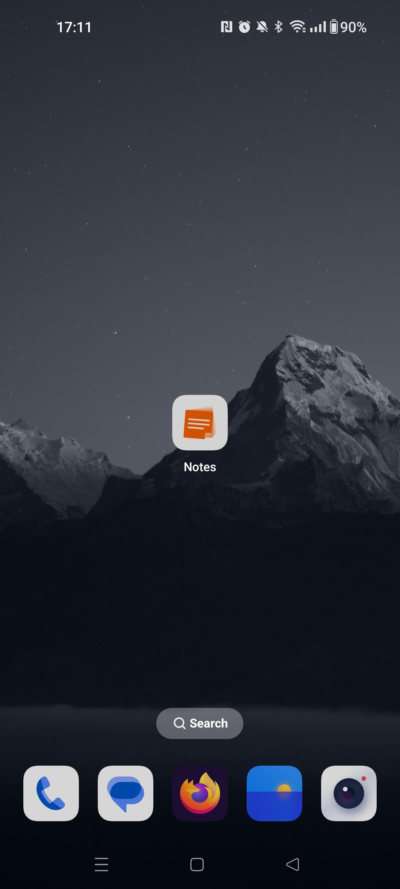
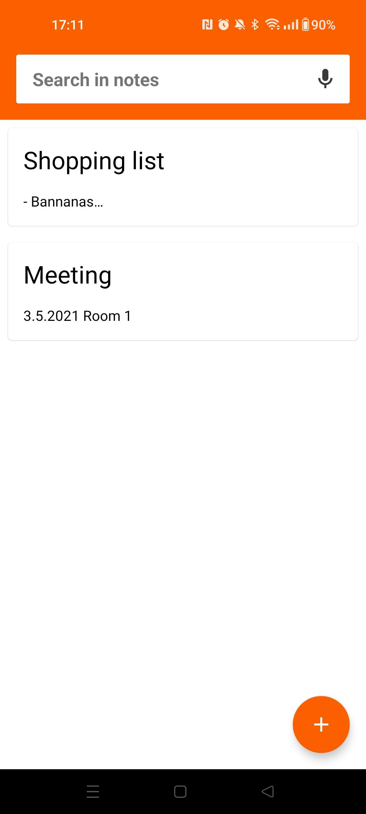
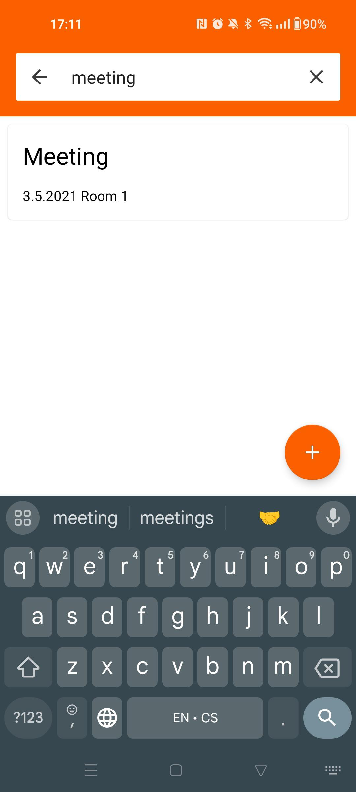
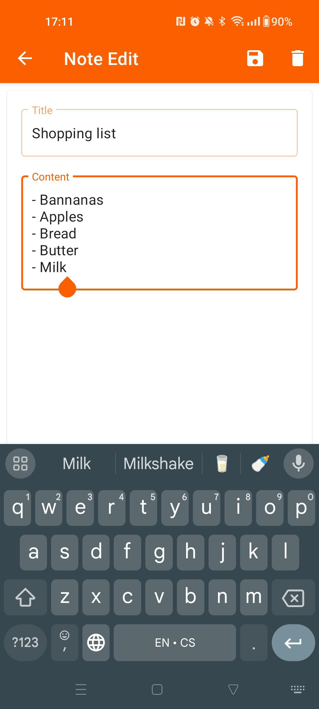

# FirestoreNotes
Závěrečný projekt za 4. ročník na SPOŠ ve Dvoře Králové nad Labem. Aplikace umožňuje vytvářet a upravovat poznámky, které jsou synchronizovány mezi zařízeními pomocí cloudové objektové databáze Google Cloud Firestore.

## Snímky obrazovky
| Snímek 1 | Snímek 2 | Snímek 3 | Snímek 4 |
| :------: | :------: | :------: | :------: |
|  |  |  |  |
